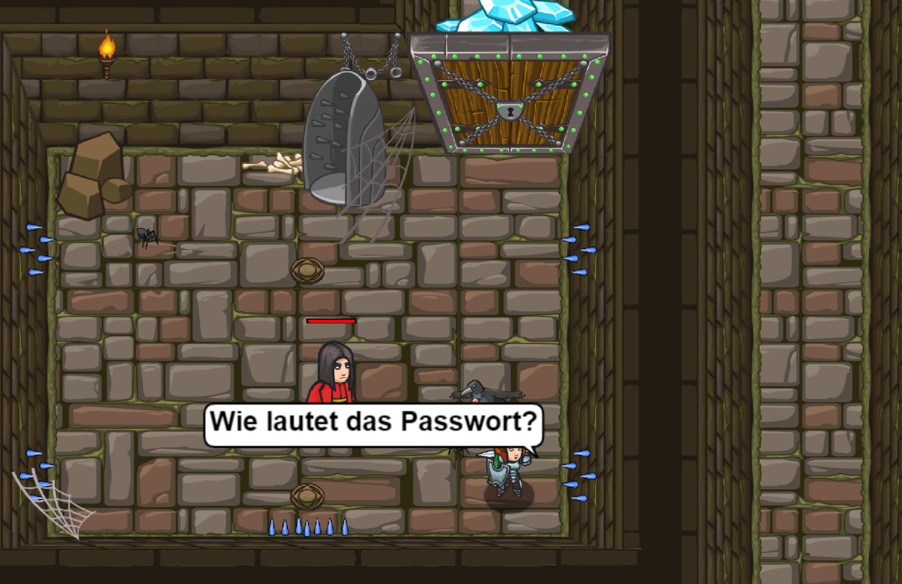

# Level 15 
## Zellenkommentar 

```js

hero.say("Wie lautet das Passwort?");
// Benutze die Funktion “say()“, um das Passwort zu sagen.
// Das Passwort ist: "Achoo"
hero.say("Achoo");
hero.moveUp();
hero.moveUp();

