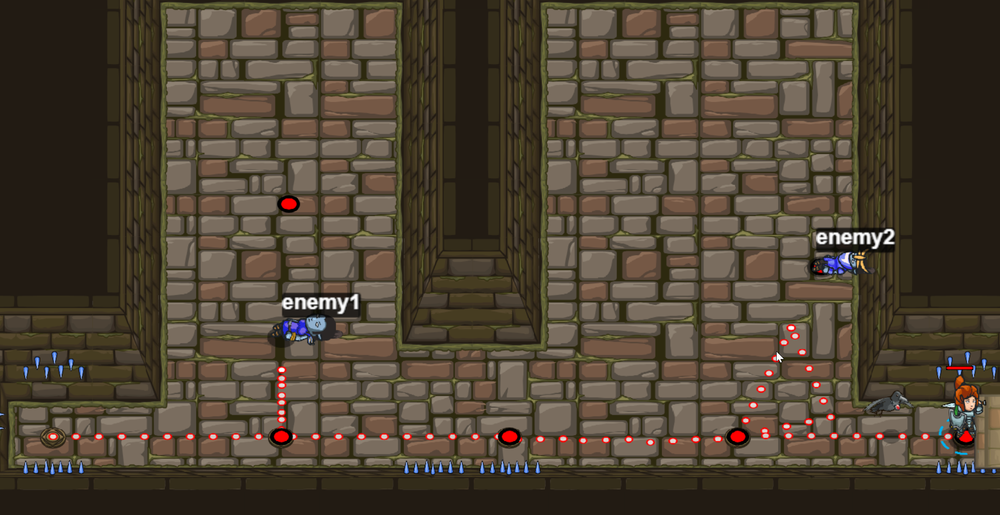

# Level 34
## Schliessen der Kluft 

```js 
hero.moveRight();

// Das sollte dir aus dem letzten Level bekannt vorkommen.
var enemy1 = hero.findNearestEnemy();
// Nun attackiere enemy1.
hero.attack(enemy1);
hero.moveRight(2);
var enemy2 = hero.findNearestEnemy();
hero.attack(enemy2);
hero.moveRight();

