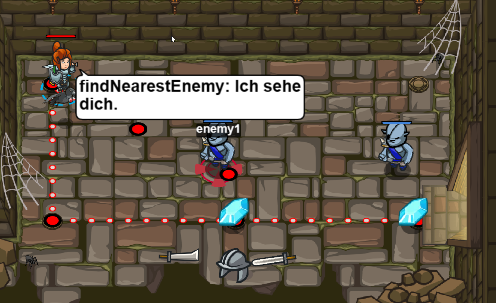

# Level 39 
## Einfacher Kithin

```js
// Erzeuge eine zweite Variable, und greif sie an.

var enemy1 = hero.findNearestEnemy();
hero.attack(enemy1);
hero.attack(enemy1);
var enemy2 = hero.findNearestEnemy();
hero.attack(enemy2);
hero.attack(enemy2);
hero.moveDown();
hero.moveRight(2);

