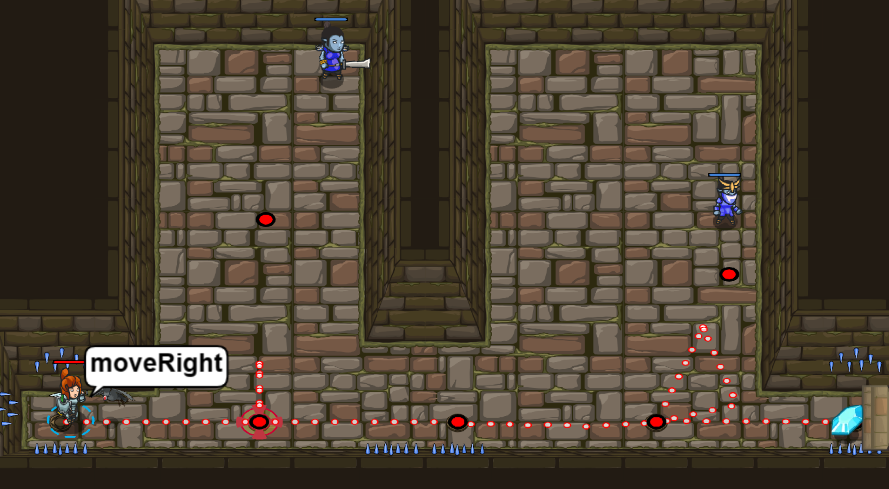

# Level 40 
## Schließen der Kluft 

```js
// Das sollte dir aus dem letzten Level bekannt vorkommen.
hero.moveRight();
var enemy1 = hero.findNearestEnemy();
// Nun attackiere enemy1.
hero.attack(enemy1);
hero.moveRight(2);
var enemy2 = hero.findNearestEnemy();
hero.attack(enemy2);
hero.moveRight();

