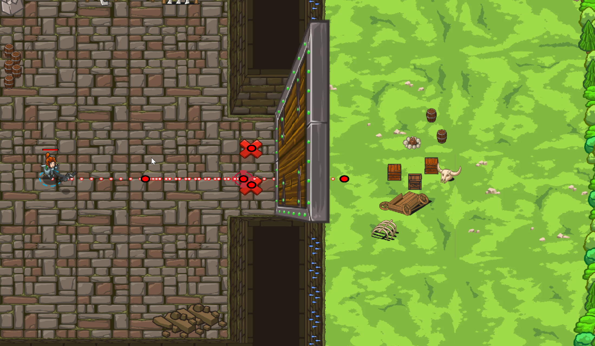

# Level 42
## Bumm! und Kaputt

```js
// Nutze deinen buildXY Hammer, um zwei "Feuer-Fallen" (fire-trap) in der Nähe vom Tor zu bauen.
// Sie werden explodieren, wenn du wieder in sicherer Entferung bist!
// Dann lauf in den Wald weg!
hero.moveRight(2);
hero.buildXY("fire-trap",35, 29);
hero.buildXY("fire-trap", 35, 35);
hero.moveLeft();
hero.moveRight(2);
